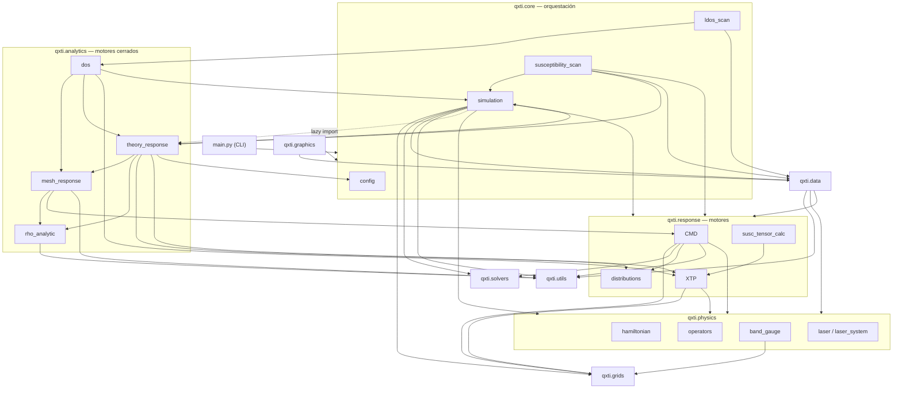

# 🗺️ Architecture Map

> El grafo real de dependencias internas (extraído de los `import` del paquete),
> las capas, y las **reglas de oro** que mantienen el orden. Volver a [[Home]].

## Capas (de orquestación → hoja)

**Leyenda de los enlaces clave**

- `simulation → theory_response` es **lazy** (import dentro de la función, `simulation.py:594`).
  `theory_response → simulation` es **top-level** (`theory_response.py:22`).
  ⛔ **No** muevas el import de `compute_hhg_spectrum` al tope de `simulation.py`: crea un
  **import circular**. Ver [[Concept - Response Engines]].
- `data` y `graphics` son *sumideros* (los importa quien exporta/plotea; ellos no suben de capa).
- `grids`, `solvers`, `utils` son **hojas** (no importan nada de `qxti`).

## Las Reglas de Oro (heredadas de [[ARCHITECTURE]] + prácticas actuales)

1. ⛔ **Unidades atómicas** en todo el núcleo. Conversión a eV/Å **solo** en [[qxti.graphics]]. → [[Concept - Atomic Units]]
2. ⛔ **El Hamiltoniano no depende del láser**, y el **láser no depende del Hamiltoniano**.
   `CMD` es la primera capa que combina ambos.
3. ⛔ **`core` no absorbe física**: orquesta y llama a `response`/`analytics`. La física vive en
   `physics`/`response`/`analytics`.
4. ⛔ **`graphics` solo plotea** desde datos en disco; no calcula física.
5. ⛔ **La config nace de un `.cfg`** ([[qxti.core|config.py]]); nada de parámetros hard-coded en el núcleo.
6. ⛔ **Un solo archivo de input** describe un modelo y sus 3 cálculos; el *flag* elige cuál corre.
7. ⛔ **Gradiente covariante de un solo tiro** (Wilson) — nunca sumar `−i[A,ρ]` aparte. → [[Concept - Perturbative Recursion]]
8. ⛔ **Protección de RAM**: dejar ≥1 GB libre siempre (mac/win/linux). → [[Concept - Memory and Parallelism]]

## Mapa de responsabilidades (tabla rápida)

| Capa | Paquete | Entra | Sale |
| --- | --- | --- | --- |
| CLI | `main.py` | `.cfg` + flag | dict de rutas escritas |
| Orquestación | [[qxti.core]] | `QXTIConfig` | datasets `.npz` en `outputs/<model>/…` |
| Motores tiempo | [[qxti.response]] `CMD` | H, láser, grids | ρ⁽ˢ⁾(k,t) |
| Motores cerrados | [[qxti.analytics]] | H, config | J⁽ˢ⁾, σ/χ, DOS |
| Observables | [[qxti.response]] `XTP` | ρ⁽ˢ⁾ | P(t), J(t), χ⁽ˢ⁾(ω) |
| Datos | [[qxti.data]] | observables | `.npz` / `.npy` |
| Gráficas | [[qxti.graphics]] | `.npz` | `.png` / `.mp4` |

## Andamiaje vacío (⚠️ no te confundas)

Estos archivos existen pero son **stubs de 1 línea** (la lógica vive en otra parte):
`physics/observables.py`, `solvers/{time_domain,frequency_domain,perturbative}_solver.py`,
`utils/{constants,math_utils,validators}.py`, `data/{exporters,loaders,pdg}.py`,
`core/results.py`, `graphics/plot_bands.py`. Ver detalle en cada nota de paquete.

---

Relacionado: [[Data Flow]] · [[Concept - Response Engines]] · [[Playbook - Invariants Not to Break]]
