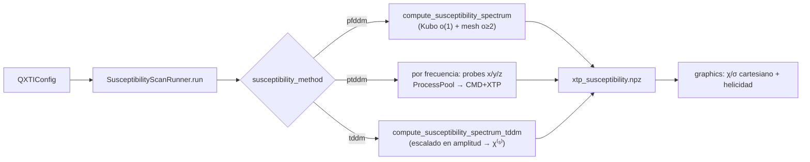

# 🔀 Data Flow

> Recorrido de principio a fin de los tres cálculos. Un `.cfg` + un *flag* eligen
> la rama. Volver a [[Home]] · Ver [[Architecture Map]].

## Punto de entrada común (`main.py`)

```
.cfg + flag ──▶ QXTIConfig.from_file() ──▶ with_standard_output_dirs()
                                            │  (outputs/<model>/{cmd,xtp,ldos,hamiltonian})
   flag=-cmd ──▶ QXTISimulation.run()
   flag=-xtp ──▶ SusceptibilityScanRunner.run()
   flag=-ldos ─▶ LDOSRunner.run()
   (sin flag) ─▶ auto: [xtp].susceptibility_enabled ? xtp : cmd
```

Detalle en [[qxti.core]]. `main.py` solo parsea el flag y despacha.

## Rama `-cmd` (HHG / corriente en el tiempo)

`response_method` decide el motor (ver [[Concept - Response Engines]]):

```mermaid
graph LR
    CFG[QXTIConfig] --> SIM[QXTISimulation.run]
    SIM --> HAM[build Hamiltonian]
    SIM --> KG[build KGrid + degeneracy guard]
    SIM --> LS[build LaserSystem]
    HAM & KG & LS --> BR{response_method}
    BR -->|pfddm| TH["theory_response.compute_hhg_spectrum<br/>(mesh cerrado, rápido)"]
    BR -->|ptddm| CMD["CMD.solve_time_domain<br/>(propaga ρ⁽ˢ⁾ perturbativo)"]
    BR -->|tddm| FULL["tddm.compute_hhg_spectrum_tddm<br/>(full no-perturbativo, gauge velocidad)"]
    BR -->|both/all| TH & CMD & FULL
    CMD --> STC["StreamingCurrentAccumulator<br/>(J intra/inter al vuelo)"]
    TH --> DS[dataset .npz]
    FULL --> DS
    STC --> XTP[XTP → J(ω), χ⁽ˢ⁾]
    XTP --> DS
    DS --> GFX[graphics: espectros, RCP/LCP, intra/inter]
```

- **pfddm** (=theory, por defecto en modelos pesados): [[qxti.analytics|theory_response]] →
  `harmonic_currents_meshed` con `return_intraband=True` → split intra/inter **real**.
- **ptddm** (=simulation): [[qxti.response|CMD]] propaga ρ⁽ˢ⁾(k,t); si `basis=band` usa
  [[qxti.data|StreamingCurrentAccumulator]] (J(t) sin materializar ρ).
- **tddm** (nuevo, no-perturbativo): [[qxti.analytics|tddm.py]] gauge velocidad, para campo fuerte.
- **all** → los 3 + `engine_comparison.npz`. Ver [[Concept - Response Engines]].
- Multi-láser → `time_domain_currents` (rama tiempo, pfddm pulsado).

Claves: [[Concept - Inter-Intra Decomposition]] · [[Concept - Memory and Parallelism]].

## Rama `-xtp` (tensores σ/χ vs ω)



- **pfddm**: orden 1 vía Kubo (streaming, ver [[qxti.analytics|rho_analytic.sigma1_kubo]]),
  órdenes ≥2 vía `_mesh_susceptibility` (ThreadPool sobre freq×dir).
- **ptddm**: paraleliza **por frecuencia** con `ProcessPoolExecutor`; cada worker corre `CMD`+`XTP`.
- **tddm**: M amplitudes E0 por frecuencia + ajuste polinomial → χ⁽ˢ⁾. Ver [[qxti.core|susceptibility_scan]].
- Tensor completo (componentes fuera de diagonal) → [[qxti.response|SusceptibilityTensorCalculator]] (LSQ).

## Rama `-ldos` (densidad de estados)

```mermaid
graph LR
    CFG[QXTIConfig] --> RUN[LDOSRunner.run]
    RUN --> M{ldos.method}
    M -->|eigenvalues| E["DOS bulk: diag H(k) + broadening"]
    M -->|surface| S["López-Sancho: G superficie<br/>arcos de Fermi (bottom/top/both)"]
    M -->|finite| F["placa finita: H real-space<br/>LDOS(r,E)"]
    E & S & F --> DS[ldos.npz]
    DS --> GFX[graphics: g(E), PDOS, A(k,E), plano E₀]
```

Todo en [[qxti.analytics|dos.py]] (`compute_dos_spectrum`). Los pesos de cuadratura BZ
coinciden con los de `XTP` (regla de suma ∫g dE = basis_size). Ver [[Concept - BZ Grid and Degeneracy Guard]].

## Salida en disco (convención)

```
outputs/<model>/
  hamiltonian/  data/*.npz  +  *.png
  cmd/          data/{current_spectrum.npz, rho_order_*.npy, population/coherence}  +  *.png/*.mp4
  xtp/          data/xtp_susceptibility.npz  +  xtp_susceptibility/order_*/…
  ldos/         data/ldos.npz  +  *.png
```

`graphics.py` sin flag auto-detecta qué familias tienen datos y plotea solo esas.
Ver [[qxti.graphics]].

---

Relacionado: [[Architecture Map]] · [[Concept - Response Engines]] · [[qxti.core]]
